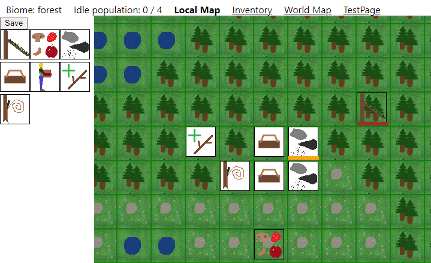
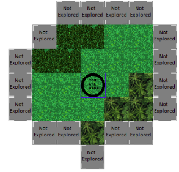

# Settlers and Warlords

This game is a blend of an Idle game, a factory-builder and an MMO game. It is a conceptual expansion of a previous project of mine, DanIdle, accounting for land expansion, travel limitations, and managing neighboring civilizations (some hostile). Players will be encouraged to trade & negotiate with each other, instead of using all-out war for dominance. MMO player strength will be limited by challenges of holding large amounts of land.

Players will start the game with a piece of land, and 4 workers - nothing else. They will have to manage survival needs (food, shelter, warmth, safety, health) while building their technology from the land around them.

The world will be fraught with dangers, some magical and unnatural, and also other players.

I have learned a lot about early technology through working on this project (How do you mine without a pickaxe? Where does twine come from? How do you ferment wine?) I hope to, if nothing else, spark interest in the subject for others.

This is planned to be a community project. If you're interested in the game, download the project and check it out for yourself! Feel free to ask questions, post new issues, tackle existing issues and commit changes.

### See it in action

If you would like to see this project in action (no install necessary), I have it running at http://bookalong.x10host.com/settlerswarlords I update this on occasion, but the source here will be the latest content.

## Project Setup

To get this running on your own computer, you will need WAMP (or substitute another setup that provides PHP and MySQL), and also NPM (provided when installing node.js). Make sure WAMP is running.

First, unzip all the files into a folder where your WAMP server's public HTML content can be displayed. This can be a subfolder if you have other projects, or from the root.

In src/App.js, set serverURL and imageURL to WAMP's relative path of your project (it's currently set to be a subfolder called settlerswarlords; you can change it to whatever, this only affects matters during development).

Next, import the database into MySQL. The file is called settlerswarlords.sql. Note that this only contains table structures; data will be generated by the code. You will also need to edit the file at server/config.php to fit the login credentials for your database.

Next, navigate to the project's root folder using Command Prompt (or equivalent if not in Windows), and run 'npm install'. This will set up everything needed for the client code.

Once done, you can run 'npm start' to start the client code. If WAMP is running and your serverURL & imageURL variables are set correctly, you will see the banner image at top - you're ready to go! The database tables start empty; the world is generated when the first player creates an account. So sign yourself up and enjoy!

## Development

There is a lot planned for this game, and a lot to get done. Ultimately, I want players to have to work toward unlocking new technologies, relying on automating common tasks to make the process easier. Here are a few progression trees:

-   [Tech Tree](/notes/techtree.md)
-   [Automation Path](/notes/automationtree.md)
-   [Means of War](/notes/wartree.md)

And additional information

-   [World Gen](/notes/worldgen.md)
-   [World History](/notes/worldhistory.md)
-   [Magic System](/notes/magicsystem.md)
-   [Underground Biomes](/notes/undergroundbiomes.md)
-   [Worker Crafting](/notes/workercrafting.md)
-   [Future Processes Planned](/notes/futureprocesses.md)
-   [Influences from other games](/notes/influences.md)

Currently, players can start playing the game, but there's only two structures available: the lean-to and forage post. I am still working on getting workers to accept tasks properly.
